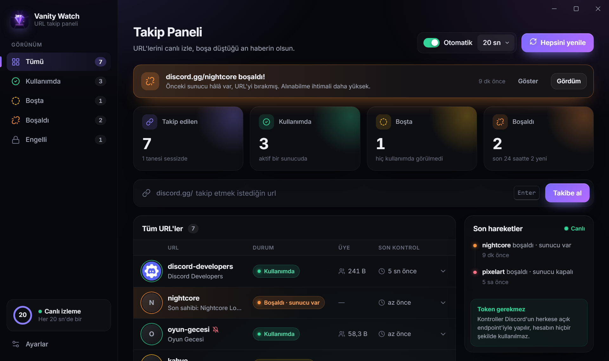
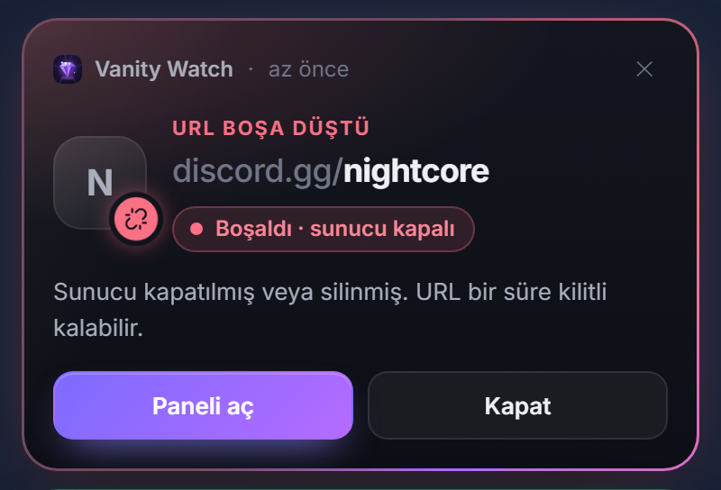

<div align="center">


# Vanity Watch

**Discord vanity URL'lerini takip et, boşa düştüğü an haberin olsun.**

Token istemeyen, tamamen senin bilgisayarında çalışan, tepside neredeyse hiç kaynak harcamayan açık kaynak masaüstü uygulaması.

[](https://github.com/Mavrom/vanity-watch/releases/latest)
[](https://github.com/Mavrom/vanity-watch/actions/workflows/ci.yml)
[](LICENSE)


[**⬇ İndir (kurulumsuz .exe)**](https://github.com/Mavrom/vanity-watch/releases/latest) · [Özellikler](#ne-yapar) · [Geliştirme](#geli%C5%9Ftirme)

*A tiny open-source desktop app that watches Discord vanity URLs and notifies you the moment one is released. [English summary](#english) below.*

<br>



</div>

### Boşa düştüğü anı kaçırma

Takip ettiğin bir URL boşaldığında sağ altta **sen kapatana kadar kalan** bir bildirim çıkar, uygulama içinde de uyarı bandı belirir.

<p align="center"></p>

## Ne yapar?

- İstediğin vanity URL'leri ekle, her birinin durumunu canlı bir panelde gör:
  - 🟢 **Kullanımda**: sunucu adı, ikonu, üye sayısı
  - 🟡 **Boşta görünüyor**: hiçbir sunucu kullanmıyor (alınabilir olması garanti değil)
  - 🟠 **Boşaldı · sunucu var**: önceki sunucu URL'yi bırakmış
  - 🔴 **Boşaldı · sunucu kapalı**: önceki sunucu silinmiş/kapatılmış, URL bir süre kilitli kalabilir
  - 🔒 **Engelli**: topluluk listesinde ya da senin "alınamıyor" işaretinde
- 10–60 saniyede bir otomatik kontrol, geri sayım göstergesi, tek tek veya toplu yenileme
- URL boşa düşünce kapatana kadar kalan bildirim kartı ve uygulama içi uyarı bandı, URL bazında sessize alma
- Durum geçmişi, son hareketler akışı ve not alanı
- Tepside hafif çalışma (pencere kapanınca arayüz bellekten silinir), isteğe bağlı Windows ile başlatma

## Ne yapmaz?

- **Token istemez.** Kullanıcı ya da bot token'ı yok; kontroller Discord'un herkese açık, kimlik doğrulama gerektirmeyen invite ve widget endpoint'leriyle yapılır.
- **URL'yi otomatik almaz (sniping yok).** Bu, kullanıcı token'ı ile otomasyon gerektirir ve Discord Hizmet Şartları'nı ihlal eder.
- Bir URL'nin kesin olarak alınabilir olduğunu söyleyemez: Discord bazı kelimeleri rezerve eder ve bunu herkese açık API'den öğrenmenin yolu yoktur.

## Kurulum

[Releases](https://github.com/Mavrom/vanity-watch/releases/latest) sayfasından:

- **`…_portable.exe`**: kurulum yok, indir ve çift tıkla.
- **`…-setup.exe`** veya **`.msi`**: Başlat menüsü kısayolu ve kaldırma desteğiyle kurulum.

Exe imzasız olduğu için Windows ilk açılışta uyarı gösterebilir: **Ek bilgi → Yine de çalıştır**.

## Geliştirme

Gereksinimler: Node.js 20+, Rust (stable), Windows'ta WebView2 (Windows 10/11'de yüklü gelir).

```bash
npm install
npm run tauri dev            # uygulamayı geliştirme modunda aç
npm run dev                  # sadece arayüz, tarayıcıda örnek verilerle (http://localhost:1420)
npm test                     # arayüz testleri
cd src-tauri && cargo test   # backend testleri
npm run tauri build          # release build
```

## Engelli listesine katkı

Boşta görünen ama kendi sunucunda almayı denediğinde Discord'un izin vermediği bir URL bulduysan,
`known-blocked.json` dosyasına ekleyip PR aç. Kurallar: küçük harf, sadece `a-z0-9-`, alfabetik sıralı, tekrar yok
(CI bunu kontrol eder). Liste bir sonraki sürümle uygulamaya gömülür.

## English

Vanity Watch tracks Discord vanity invite codes using only Discord's public, unauthenticated endpoints
(`GET /invites/{code}` and `GET /guilds/{id}/widget.json`). It never asks for a token and never claims URLs.
When a tracked code is released you get a native notification. Closing the window destroys the webview and
leaves a tiny tray process running.

## Lisans

MIT. İkonlar [Lucide](https://lucide.dev) (ISC) yollarından uyarlanmıştır. Font: [Inter](https://rsms.me/inter/) (OFL).
